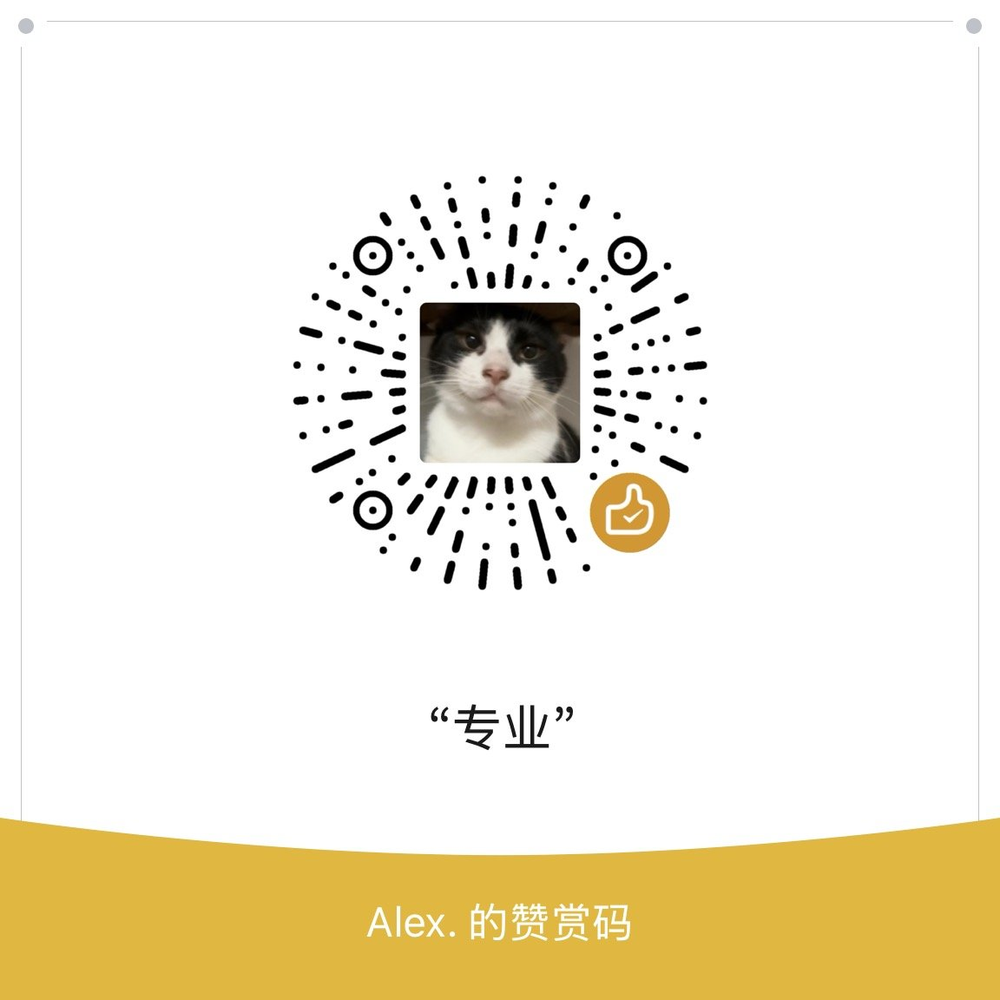

<div align="center">

# Alice Assistant

**Client manager for AI coding agents**

A portable desktop tool that decouples prompts, skill packs, and clients — combine them freely, deploy to any agent.


**English** · [简体中文](README.md)

</div>

---

### What it is

Alice Assistant is a portable Windows desktop tool for managing the **prompts** and **skill libraries** of AI coding agents.

It decouples three things that are usually tangled together: prompts, skill packs, and clients. Any prompt can be paired with any skill pack and deployed to any client. Switching a combination takes one click in the UI — no manual directory browsing, no copy-pasting files.

**It does not restrict which client you use.** Common agents ship as built-in presets, and you can also point it at anything else yourself: pick a prompt file, pick a skill folder, pick a target folder — that client is now supported.

The whole runtime (including a bundled portable Codex) ships inside the package. Copy it to any Windows machine and it works as-is: no registry writes, no system pollution, and uninstalling means deleting the folder.

---

### Highlights

| Capability | Description |
|---|---|
| **Prompt management** | Prompts are real files on disk, read directly by the UI; reference the built-in asset library or any local file |
| **Skill library management** | Skills are managed as packs and synced into each client's skill directory; `simple` / `tree` / `router` layouts are detected automatically and copied as whole trees so sub-skills and relative references stay valid |
| **Free combination** | Prompt × skill pack × client, in any combination. One combination = one `manifest.json`; adding one = adding a directory, removing one = deleting a directory, with no code changes |
| **No client restrictions** | Built-in presets for common agents, plus custom setups: specify a prompt file, a skill folder, and a target folder to wire up any client |
| **Bundled portable Codex** | The Codex runtime ships in the package — works out of the box, no system install required |
| **Environment isolation** | Child processes get redirected `CODEX_HOME` / `APPDATA` / `LOCALAPPDATA` / `TEMP` / `PATH`; your real user configuration is never touched |
| **Path-agnostic** | Resolved by probing env var → bundle layout → resource dir → dev fallback. No hardcoded drive letters, no config edits when you move the folder |
| **In-app tutorial** | 6 of the feature pages (Targets / Skills / Prompts / Session / Alice-codex / Cloud) ship a step-by-step guided tour that dims the screen, highlights the element you should look at, and explains it; skip or replay at any time. Pages without a configured tour show no entry button |
| **Backup-first writes** | Every client backs up the original first (renamed to `-bak` or `.bak-inject`) before the rendered content is written; uninstalling restores the backup. Whether reinstalling accumulates depends on the write mode — see "Supported clients" below |

---

### Bundled runtime: portable Codex

| Point | Description |
|---|---|
| Ships in the package | Runtime, dependencies, and private `APPDATA` / `TEMP` all live inside the bundle |
| Random instance name | Each launch creates a random process image name (via a hard link, so it shares the same data and **costs no extra disk space**); the UI shows the current instance name so multiple instances stay distinguishable |
| Automatic cleanup | The process is attached to a Job Object at creation, so the kernel reclaims the whole process tree when the main app exits — no leftovers |
| One-click self-check | Verifies the 5 runtime items (config / codex runtime / desktop app / skill library / prompt library) and probes real versions (codex, adb, python), showing pass/fail with expandable detail |
| Two forms | CLI (standalone console TUI) and the desktop app, each with its own config directory, isolated from any system-wide install |

---

### Supported clients

Every client **backs up first**: the existing file is renamed to `-bak`, then the rendered content is written; uninstalling restores the `-bak`. The **write mode differs per client**, in three flavours:

| Write mode | Semantics | Used by |
|---|---|---|
| `markedBlock` | Marker-block replacement: replace inside the block if present, otherwise append | Codex, DSH |
| `overwrite` | Whole-file overwrite (no marker, not idempotent) | ZCode, Cursor, WorkBuddy |
| `claudeBlock` | Four branches: block present → replace inside; empty/pure-prompt → whole file; leftovers → move aside for evidence; user content → back up once then append | Claude |

Injection targets:

| Client | Injection target |
|---|---|
| Codex | `~/.codex/AGENTS.md` |
| ZCode | `~/.zcode/AGENTS.md`<br>`~/.zcode/cli/memories/global/memory/seagull-agents.md` (memory) |
| Cursor | `~/.cursor/rules/<name>.mdc`<br>`~/.cursorrules` |
| Claude | `~/.claude/CLAUDE.md` |
| WorkBuddy | `~/.workbuddy-ai/memory/default_memory.md`<br>`~/.workbuddy-ai/MEMORY.md` |
| DSH | `~/.dsh/AGENTS.md` |
| **Custom** | Your own prompt file + skill folder + target folder — any client |

> WorkBuddy does **not** write `AGENTS.md` — it goes through its cloud memory archive plus `MEMORY.md`, unlike the other clients.
> The complete injection spec (markers, backup policy, skill destinations) lives in `src/lib/inject-spec.ts`.

---

### UI

A Tauri native shell with a React single-page interface. Prompt lists, skill libraries, version manifests, runtime control, self-check results, and live logs all live on one screen — state is visible directly instead of buried in log files.

---

### Tech stack

**Frontend** (`package.json`)

| Layer | Choice |
|---|---|
| UI | React 19 + TypeScript 5.7 |
| Bundler | Vite 6 |
| Icons | lucide-react |
| Tauri bindings | @tauri-apps/api 2.11 |

**Backend** (`src-tauri/Cargo.toml`)

| Layer | Choice |
|---|---|
| Desktop shell | Tauri 2 + Rust (edition 2021) |
| Plugins | `tauri-plugin-shell` / `-dialog` / `-fs` |
| Serialization | serde + serde_json |
| Regex | regex |
| HTTP | ureq (used by the cloud-audit proxy to forward upstream) |
| Archive | zip (`deflate` only, for importing user-supplied skill packs) |
| Encoding | base64 (session image upload) |

The release profile uses `lto = true` / `codegen-units = 1` / `opt-level = "s"` / `strip = true` / `panic = "abort"` — portable distribution favours size.

---

### Build

#### Prerequisites

| Dependency | Version | Notes |
|---|---|---|
| **Node.js** | ≥ 18 (tested 24.19) | Frontend build |
| **pnpm** | ≥ 9 (tested 11.8) | The repo ships only `pnpm-lock.yaml` — there is **no** `package-lock.json` |
| **Rust** | stable (tested 1.98.1) | Backend compilation |
| **MSVC toolchain** | VS Build Tools 2022 + the **VCTools workload** | Rust targets MSVC; without `link.exe` you get `link.exe not found` |
| **WebView2 Runtime** | — | Bundled with Windows 11; install separately on Windows 10 |

> **pnpm is required**: the lockfile in this repo is `pnpm-lock.yaml`. `npm install` ignores it and re-resolves dependencies from `package.json`, which may pull versions that differ from the released build.

#### 1. Install dependencies

```bash
pnpm install
```

#### 2. Development

`beforeDevCommand` in `tauri.conf.json` is **empty** — `tauri dev` will *not* start the frontend server for you. Use two terminals:

```bash
# Terminal 1: long-running frontend server (fixed port 5183, matching devUrl)
pnpm run web

# Terminal 2: launch the Tauri window
pnpm run desktop
```

`pnpm run desktop` runs `vite build` then `tauri dev`. The second terminal needs the MSVC environment, otherwise linking fails:

```powershell
# PowerShell: wrap with vcvars64 first (adjust the path to your VS install)
$vs = "C:\Program Files (x86)\Microsoft Visual Studio\2022\BuildTools"
cmd /c "`"$vs\VC\Auxiliary\Build\vcvars64.bat`" && pnpm run desktop"
```

**UI only, no Rust compilation**: just run `pnpm run web` and open `http://127.0.0.1:5183`. Backend calls degrade gracefully (the UI shows "browser preview"), but the interface, themes, and the tutorial tour all work.

#### 3. Production build

```bash
pnpm run release
```

This is equivalent to:

```bash
tsc --noEmit                                    # type check
vite build                                      # frontend → dist/
cargo build --release --features custom-protocol --manifest-path src-tauri/Cargo.toml
```

Output: `src-tauri/target/release/alice-ui.exe`

> **`--features custom-protocol` is not optional.**
> tauri's `build.rs` contains `let dev = !custom_protocol;` — without this feature,
> cargo emits `cargo:rustc-cfg=dev` and the binary becomes a dev build: it loads
> `devUrl` (`http://127.0.0.1:5183`) from `tauri.conf.json` and does **not** embed
> `dist/`. The symptom is a window with the correct title showing
> "**Hmm… can't reach this page / 127.0.0.1 refused to connect**".

You can verify the binary is not a dev build (the dist asset name should appear inside the exe):

```powershell
# Absolute paths are required: .NET File APIs resolve relative paths against the
# process start directory, not PowerShell's current location, so a relative path
# fails with "could not find a part of the path" even after Set-Location.
$root  = (Get-Location).Path
$exe   = Join-Path $root 'src-tauri\target\release\alice-ui.exe'
$dist  = Join-Path $root 'dist\assets'
$asset = (Get-ChildItem $dist -Filter 'index-*.js' | Select-Object -First 1).Name
$ascii = [System.Text.Encoding]::ASCII.GetString([System.IO.File]::ReadAllBytes($exe))
if ($ascii.Contains($asset)) { "OK: $asset embedded" } else { "Unexpected: this is a dev-mode binary" }
```

#### 4. Assembling a distribution folder

This source repository **does not include the runtime body** (`resources/` is not committed — it holds the Codex runtime, skill libraries, and assets, which are too large and license-encumbered for Git). To get a runnable distribution:

```
<dist-dir>/
├── alice-ui.exe          ← produced by the previous step, may be renamed
└── resources/            ← runtime body, you supply it
    ├── .codex/           config.toml / prompts / skills / mcp
    ├── runtime/codex/    portable Codex CLI
    ├── tools/            adb and friends
    ├── _assets/          asset library (prompts / skill)
    └── profiles/         client presets and version manifests
```

The app probes for the runtime root in this order (`runtime_root` in `runtime.rs`) — **no drive letters are hardcoded**:

1. `ALICE_RUNTIME_ROOT` environment variable (troubleshooting / custom deployment)
2. `resources/` next to the exe
3. `resources/王炸codex` next to the exe (legacy wrapper layout)
4. `王炸codex/` next to the exe
5. Tauri `resource_dir`
6. Development fallback (current working directory)

A directory qualifies if it **contains `.codex` or `runtime`**, so a differently-named folder still works as long as it satisfies that.

A deploy script is provided:

```powershell
# Print the plan only, change nothing
powershell -File deploy-aijail-opt.ps1 -WhatIfOnly

# Perform the deploy (default target: a "新alice助手" folder beside the repo)
powershell -File deploy-aijail-opt.ps1 -Pkg <dist-dir>
```

It stops running processes, backs up the old exe as `*.rollback-<timestamp>`, copies the new exe, and restarts.

#### 5. Build-time cautions

Do **not** redistribute the following if you have them locally (see `NOTICE`):

- The OpenAI Codex / ChatGPT **desktop app** (`resources/runtime/desktop/`) — proprietary, no redistribution right granted
- Personal session records, memory stores, or state databases (`*.sqlite`, `sessions/` under `.codex`)
- API keys inside `config.toml`

#### Repository layout

```
alice-ui/
├── src/                    Frontend (React + TS)
│   ├── components/         Shared components (incl. the tour.tsx tutorial engine)
│   ├── lib/                store / backend bindings / tour step tables
│   ├── pages/              Feature pages
│   └── styles/             Design-system tokens.css
├── src-tauri/              Backend (Rust)
│   ├── src/                inject / profiles / runtime / cloud / alias …
│   ├── capabilities/       Tauri permission manifests
│   └── tauri.conf.json     Window / build config
├── docs/screenshots/       README images
└── deploy-aijail-opt.ps1   Deploy script
```

#### npm scripts

| Script | Purpose |
|---|---|
| `pnpm run web` | Frontend dev server (port 5183, strict) |
| `pnpm run dev` | Same, without a pinned port |
| `pnpm run check` | Type check only (`tsc --noEmit`) |
| `pnpm run build` | Type check + frontend bundle |
| `pnpm run desktop` | Frontend bundle + `tauri dev` |
| `pnpm run release` | Full production build (incl. Rust release) |
| `pnpm run release:exe` | Rust release compile only |

---

### Status

**Work in progress, not released.** Only local build artifacts exist so far; APIs, manifest format, and directory layout may all change.

---

### License

Licensed under the **[GNU General Public License v3.0](LICENSE)** (GPL-3.0-or-later).

| You may | You must | You may not |
|---|---|---|
| Run the program for any purpose | Ship the license and copyright notice when distributing | Add extra restrictions to derivative works |
| Modify and build upon it | Indicate whether changes were made | Use technical measures to block permitted uses |
| Copy and redistribute | **License derivatives under the GPL and provide complete corresponding source** | Merge the program into proprietary software you redistribute |
| **Use it commercially** | Keep the original copyright and license notices | |

> **This IS an open source license.** GPL-3.0 is OSI-approved free software — **commercial use is permitted**. The obligation is **copyleft**: when you distribute a derivative work, it must also be licensed under the GPL, with complete source code.

> **Scope**: this license covers **only the parts originally created by alicewe1** — the application, the client presets, the original skill pack, and the documentation in this repository. The distribution bundles third-party components, each governed by its own license; see `THIRD-PARTY-NOTICES.md` inside the distribution for the full list and attribution requirements. Third-party licenses take precedence. In particular, the OpenAI Codex / ChatGPT desktop app is **proprietary and carries no redistribution right** — it must not be redistributed with this work without separate authorization. See [`NOTICE`](NOTICE) for the full statement.

**When referencing this project or building on it, keep this attribution:**

```
Alice Assistant — https://github.com/alicewe1/alice-assistant
Copyright (C) 2026 alicewe1 — Licensed under GNU GPL v3.0 or later
```

---

## Support the project

Everything here — design, code, packaging, docs, and every on-device debugging session — is maintained by a single person. If this saved you some time, or you just want to see it keep going, feel free to use the code below.

<div align="center">



**Buy me a coffee**

</div>

No obligation at all — filing issues, reporting problems, or sharing the project with someone who needs it counts just as much.

---

<div align="center">

**English** · [简体中文](README.md)

</div>
