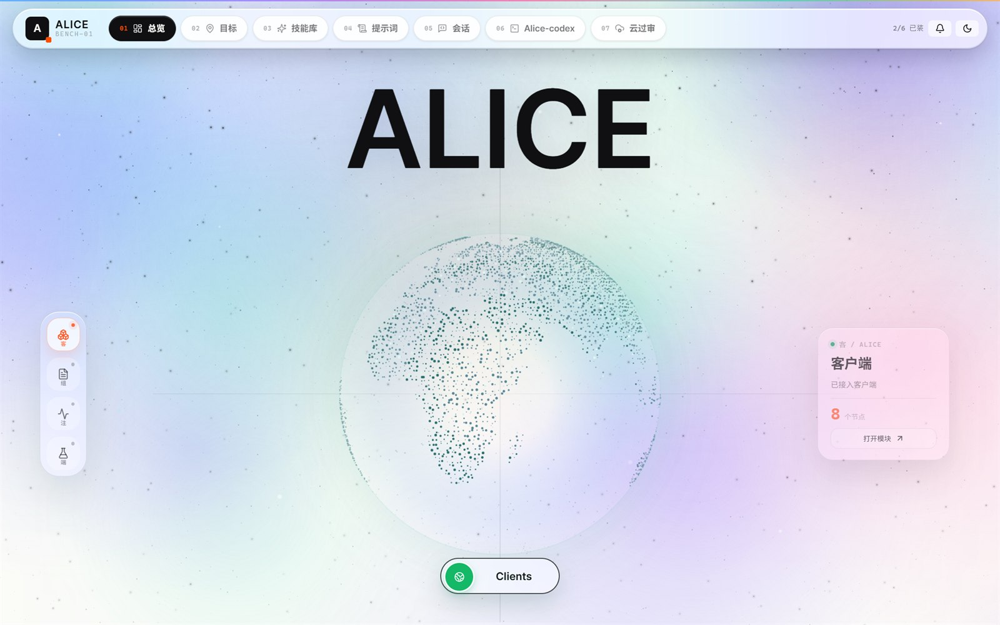
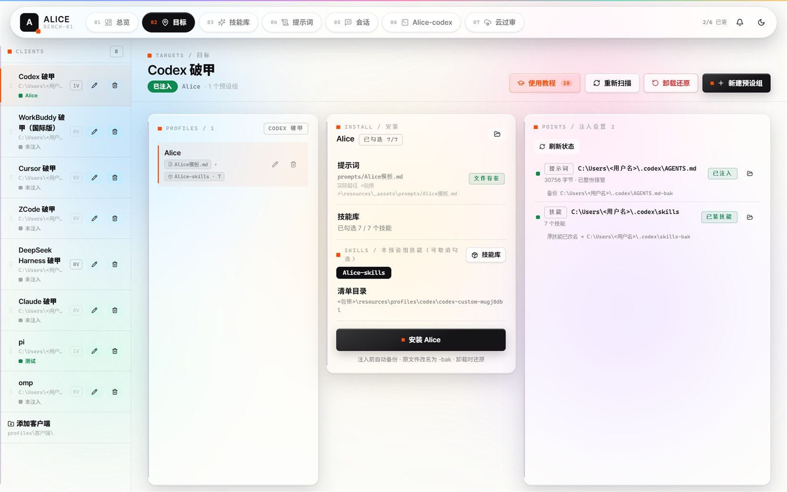
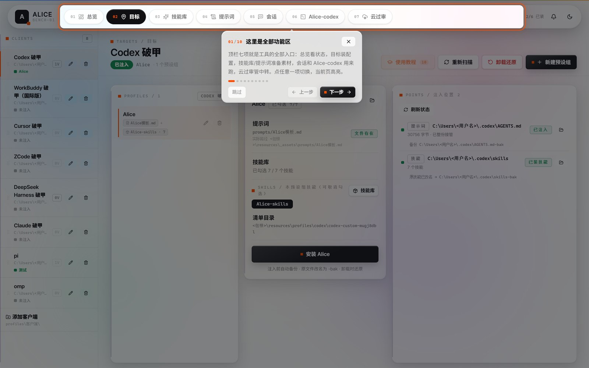

<div align="center">

# Alice 助手

**Agent 客户端管理助手**

便携式桌面工具：把提示词、技能库、客户端三者解耦，任意搭配，投放到任意 Agent。


[English](README.en.md) · **简体中文**

</div>

---

## 这是什么

Alice 助手是一个面向 Windows 的便携式桌面工具，用来管理 AI 编码 Agent 的**提示词**和**技能库**。

它把提示词、技能库、客户端三者解耦：任意提示词可以搭配任意技能库，投放到任意客户端。想换一套组合，界面上点一下就行，不需要手动翻目录、复制粘贴文件。

**它不限定客户端。** 内置了常见 Agent 的预设，同时允许你自行指定放置路径 —— 选一个提示词文件、选一个技能文件夹、选一个目标文件夹，就接入了一个新客户端。

整个运行时（含内置的便携式 Codex）随包分发，拷到任意 Windows 机器上直接可用：不写注册表、不污染系统环境、卸载就是删文件夹。

---

## 界面

<div align="center">



*总览 —— 客户端接入状态一屏看全*

</div>

<div align="center">



*目标 —— 选客户端 → 选预设组 → 确认提示词与技能 → 一键注入*

</div>

6 个功能页的右上角有**使用教程**：点开后整屏压暗、当前该看的元素被挖孔高亮，旁边气泡讲解这一步在做什么，逐步走完一个页面。下面是教程第 1 步的效果：

<div align="center">



*新手教程 —— 挖孔高亮 + 指示箭头 + 分步讲解，支持跳过 / 上一步 / 下一步*

</div>

---

## 核心能力

| 能力 | 说明 |
|---|---|
| **提示词管理** | 提示词以真实文件落盘，界面直接读磁盘；既可引用内置素材库，也可指向任意本地文件 |
| **技能库管理** | 技能以「包」为单位管理，安装时同步到目标客户端技能目录；自动识别 `simple` / `tree` / `router` 三种形态，整树复制以保住子技能与相对引用 |
| **自由搭配** | 提示词 × 技能库 × 客户端 任意组合。一个组合 = 一份 `manifest.json`；加一套 = 加一个目录，删一套 = 删一个目录，全程不改代码 |
| **客户端无限制** | 内置常见 Agent 预设，更支持自定义：指定「提示词文件 + 技能文件夹 + 目标文件夹」即可接入任意客户端 |
| **内置便携式 Codex** | 随包分发 Codex 运行时，开箱即用，不需要系统预装 |
| **环境隔离** | 启动子进程时重定向 `CODEX_HOME` / `APPDATA` / `LOCALAPPDATA` / `TEMP` / `PATH`，不碰真实用户配置 |
| **路径自适应** | 按 环境变量 → 分发形态 → 资源目录 → 开发兜底 逐级探测，不写死盘符，换机器不用改配置 |
| **新手教程** | 6 个功能页（目标 / 技能库 / 提示词 / 会话 / Alice-codex / 云过审）内置分步指引，高亮当前该操作的元素并说明用途，可随时跳过或重看；未配教程的页面不显示入口按钮 |
| **哈希留档备份** | 所有客户端统一先备份原件（改名为 `-bak` 或 `.bak-inject`），再写入渲染结果；卸载 = 还原备份。重复安装是否叠加取决于写入模式，见下方「支持的客户端」 |

---

## 内置运行时：便携式 Codex

| 点 | 说明 |
|---|---|
| 随包分发 | 运行时、依赖、私有 `APPDATA` / `TEMP` 全部在包内，不往系统里装东西 |
| 随机实例名 | 每次启动生成随机进程镜像名（硬链接实现，与本体共享同一份数据，**不额外占磁盘**），界面显示当前实例名，多实例互不混淆 |
| 自动回收 | 进程创建时即挂入 Job Object，主程序退出时由内核回收整棵进程树，不留残留进程 |
| 一键自检 | 逐项体检 5 项运行时（配置 / codex 运行时 / 桌面端 / 技能库 / 提示词库），并真实探测 codex、adb、python 版本；通过项与诊断明细直接展示 |
| 双形态 | CLI（独立控制台 TUI）与桌面端，各自独立配置目录，与系统已装版本互不干扰 |

---

## 支持的客户端

所有客户端**统一先备份**：目标文件改名为 `-bak` 保留原件，再写入渲染结果；卸载 = 还原 `-bak`。但**写入模式按客户端区分**三种：

| 写入模式 | 语义 | 用在 |
|---|---|---|
| `markedBlock` | 标记块替换：块存在只换块内，否则追加 | Codex、DSH |
| `overwrite` | 整份覆盖（无标记、无幂等） | ZCode、Cursor、WorkBuddy |
| `claudeBlock` | 四分支：有块→换块内；空/纯提示词→整份；残渣→挪走留证；用户内容→首次备份后追加 | Claude |

各客户端的注入落点：

| 客户端 | 注入目标 |
|---|---|
| Codex | `~/.codex/AGENTS.md` |
| ZCode | `~/.zcode/AGENTS.md`<br>`~/.zcode/cli/memories/global/memory/seagull-agents.md`（记忆） |
| Cursor | `~/.cursor/rules/<名称>.mdc`<br>`~/.cursorrules` |
| Claude | `~/.claude/CLAUDE.md` |
| WorkBuddy | `~/.workbuddy-ai/memory/default_memory.md`<br>`~/.workbuddy-ai/MEMORY.md` |
| DSH | `~/.dsh/AGENTS.md` |
| **自定义** | 自选「提示词文件 + 技能文件夹 + 目标文件夹」，接入任意客户端 |

> WorkBuddy **不写 `AGENTS.md`** —— 它走云记忆档案 + `MEMORY.md`，与其它客户端不同。
> 完整注入规格（标记串、备份策略、技能落点）见 `src/lib/inject-spec.ts`。

---

## 技术栈

**前端**（`package.json`）

| 层 | 选型 |
|---|---|
| 界面 | React 19 + TypeScript 5.7 |
| 构建 | Vite 6 |
| 图标 | lucide-react |
| Tauri 绑定 | @tauri-apps/api 2.11 |

**后端**（`src-tauri/Cargo.toml`）

| 层 | 选型 |
|---|---|
| 桌面外壳 | Tauri 2 + Rust（edition 2021） |
| 插件 | `tauri-plugin-shell` / `-dialog` / `-fs` |
| 序列化 | serde + serde_json |
| 正则 | regex |
| HTTP | ureq（云过审转发上游用） |
| 解压 | zip（仅开 `deflate`，用于导入用户自备的技能包） |
| 编码 | base64（会话图片上传） |

Release 侧开了 `lto = true` / `codegen-units = 1` / `opt-level = "s"` / `strip = true` / `panic = "abort"` —— 便携分发优先体积。

Tauri 原生外壳 + React 单页界面。提示词列表、技能库、版本清单、运行时控制、自检结果、实时日志都在同一屏里完成，状态直接可见，不用去翻日志文件。

---

## 从源码构建

### 前置环境

| 依赖 | 版本要求 | 说明 |
|---|---|---|
| **Node.js** | ≥ 18（实测 24.19） | 前端构建 |
| **pnpm** | ≥ 9（实测 11.8） | 仓库只带 `pnpm-lock.yaml`，**没有 `package-lock.json`** |
| **Rust** | stable（实测 1.98.1） | 后端编译 |
| **MSVC 工具链** | VS Build Tools 2022 + **VCTools 工作负载** | Rust 装的是 MSVC 目标，缺 `link.exe` 会直接报 `link.exe not found` |
| **WebView2 Runtime** | — | Win11 自带；Win10 需自行安装 |

> **为什么必须用 pnpm**：仓库里的锁文件是 `pnpm-lock.yaml`。用 `npm install` 会忽略它、按 `package.json` 重新解析依赖，装出来的版本可能和发布版不一致。

### 1. 安装依赖

```bash
pnpm install
```

### 2. 开发模式

`tauri.conf.json` 里的 `beforeDevCommand` 是**空的** —— 也就是说 `tauri dev` **不会**自动帮你起前端服务，需要开两个终端：

```bash
# 终端 1：常驻前端服务（固定 5183 端口，与 devUrl 一致）
pnpm run web

# 终端 2：起 Tauri 窗口
pnpm run desktop
```

`pnpm run desktop` 会先 `vite build` 再 `tauri dev`。第二个终端需要 MSVC 环境变量，否则链接失败：

```powershell
# PowerShell：先包一层 vcvars64（路径按你的 VS 安装位置调整）
$vs = "C:\Program Files (x86)\Microsoft Visual Studio\2022\BuildTools"
cmd /c "`"$vs\VC\Auxiliary\Build\vcvars64.bat`" && pnpm run desktop"
```

**只想看界面、不编译 Rust**：直接跑 `pnpm run web`，浏览器打开 `http://127.0.0.1:5183`。此时后端调用会降级（页面显示「浏览器预览」），但界面、主题、教程指引都能看。

### 3. 生产构建

```bash
pnpm run release
```

这一步等价于三条命令：

```bash
tsc --noEmit                                    # 类型检查
vite build                                      # 前端 → dist/
cargo build --release --features custom-protocol --manifest-path src-tauri/Cargo.toml
```

产物：`src-tauri/target/release/alice-ui.exe`

> **`--features custom-protocol` 不能省。**
> tauri 的 `build.rs` 里写的是 `let dev = !custom_protocol;` —— 不开这个 feature，
> cargo 会给出 `cargo:rustc-cfg=dev`，二进制就变成 dev 模式：它去加载
> `tauri.conf.json` 的 `devUrl`（`http://127.0.0.1:5183`）而**不内嵌** `dist/`。
> 运行时的表现是窗口标题正常、内容却是「**嗯…无法访问此页面 / 127.0.0.1 拒绝连接**」。
> 所以生产构建必须显式带上它。

构建完可以自检一下有没有编成 dev 模式（exe 里应当能找到 dist 的资源名）：

```powershell
# 注意：必须用绝对路径。.NET 的 File API 按「进程启动目录」解析相对路径，
# 不受 PowerShell 的 Set-Location 影响，直接传相对路径会报「找不到路径」。
$root  = (Get-Location).Path
$exe   = Join-Path $root 'src-tauri\target\release\alice-ui.exe'
$dist  = Join-Path $root 'dist\assets'
$asset = (Get-ChildItem $dist -Filter 'index-*.js' | Select-Object -First 1).Name
$ascii = [System.Text.Encoding]::ASCII.GetString([System.IO.File]::ReadAllBytes($exe))
if ($ascii.Contains($asset)) { "OK：已内嵌 $asset" } else { "异常：这是 dev 模式二进制" }
```

### 4. 组装分发包

源码仓库**不含运行体**（`resources/` 未入库 —— 里面是 Codex 运行时、技能库与素材，体积与授权原因不适合进 Git）。要得到一个能直接跑的分发目录，需要：

```
<分发目录>/
├── alice-ui.exe          ← 由上一步构建产出，可改名
└── resources/            ← 运行体，需自行准备
    ├── .codex/           config.toml / prompts / skills / mcp
    ├── runtime/codex/    便携 Codex CLI
    ├── tools/            adb 等
    ├── _assets/          素材库（prompts / skill）
    └── profiles/         客户端预设与版本清单
```

程序按以下顺序探测运行体根（`runtime.rs` 的 `runtime_root`），**不写死盘符**：

1. `ALICE_RUNTIME_ROOT` 环境变量（排障 / 自定义部署）
2. exe 同级 `resources/`
3. exe 同级 `resources/王炸codex`（兼容旧包装结构）
4. exe 同级 `王炸codex/`
5. Tauri `resource_dir`
6. 开发期兜底（当前工作目录）

判定标准是**目录里存在 `.codex` 或 `runtime`** —— 所以哪怕目录名不同，只要满足这条也能被认出来。

部署到分发目录有现成脚本：

```powershell
# 只打印计划，不动手
powershell -File deploy-aijail-opt.ps1 -WhatIfOnly

# 实际部署（默认：仓库同级目录「新alice助手」；用 -Pkg 指定别处）
powershell -File deploy-aijail-opt.ps1
```

脚本做四件事：停掉运行中的进程 → 把旧 exe 备份成 `*.rollback-<时间戳>` → 覆盖新 exe → 重新启动。

### 5. 构建前注意

如果你自己改过运行体内容，注意这几处**不要随包分发**（`NOTICE` 里有明确说明）：

- OpenAI Codex / ChatGPT **官方桌面端**（`resources/runtime/desktop/`）—— 专有软件，未授予再分发权
- 个人的会话记录、记忆库、状态数据库（`.codex` 下的 `*.sqlite`、`sessions/`）
- `config.toml` 里的 API Key

### 仓库结构

```
alice-ui/
├── src/                    前端（React + TS）
│   ├── components/         通用组件（含 tour.tsx 教程引擎）
│   ├── lib/                store / 后端调用封装 / 教程步骤表
│   ├── pages/              功能页
│   └── styles/             设计系统 tokens.css
├── src-tauri/              后端（Rust）
│   ├── src/                inject / profiles / runtime / cloud / alias …
│   ├── capabilities/       Tauri 权限清单
│   └── tauri.conf.json     窗口 / 构建配置
├── docs/screenshots/       README 配图
└── deploy-aijail-opt.ps1   部署脚本
```

### 可用的 npm scripts

| 脚本 | 作用 |
|---|---|
| `pnpm run web` | 前端 dev server（5183，固定端口） |
| `pnpm run dev` | 同上，但不锁端口 |
| `pnpm run check` | 仅类型检查（`tsc --noEmit`） |
| `pnpm run build` | 类型检查 + 前端打包 |
| `pnpm run desktop` | 前端打包 + `tauri dev` |
| `pnpm run release` | 完整生产构建（含 Rust release） |
| `pnpm run release:exe` | 只跑 Rust release 编译 |

---

## 项目状态

**开发中，尚未发布。** 接口、清单格式与目录结构都可能变动。

---

## 许可

本项目采用 **[GNU 通用公共许可协议第 3 版](LICENSE)**（GPL-3.0-or-later）许可。

| 你可以 | 你必须 | 你不可以 |
|---|---|---|
| 以任何目的运行本程序 | 分发时附上许可协议与版权声明 | 对衍生作品附加额外限制 |
| 修改、二次创作 | 标明是否作出了修改 | 用技术手段阻止他人行使许可权利 |
| 复制、分发 | **衍生作品必须同样以 GPL 授权，并提供完整对应源码** | 将本程序并入闭源专有软件再分发 |
| **用于商业目的** | 保留原有的版权与许可声明 | |

> **这是开源许可。** GPL-3.0 通过 OSI 认证，属于自由软件许可 —— **商业使用是被允许的**。它的约束在于**传染性（copyleft）**：把衍生作品分发出去时，必须同样以 GPL 授权并提供完整源码。

> **适用范围**：本许可**仅覆盖 alicewe1 原创的部分** —— 主程序、客户端预设、原创技能包与仓库内文档。分发包内含第三方组件，各自受其自身许可约束，相关清单与署名要求见分发包内的 `THIRD-PARTY-NOTICES.md`；第三方许可优先于本许可。完整声明见 [`NOTICE`](NOTICE)。

**引用本项目或做衍生作品时，请保留以下署名：**

```
Alice 助手 / Alice Assistant — https://github.com/alicewe1/alice-assistant
Copyright (C) 2026 alicewe1 — Licensed under GNU GPL v3.0 or later
```

---

## 感谢捐赠

如果这个项目对你有帮助，可以用微信扫码下面的二维码进行捐赠。

<div align="center">


</div>

---

<div align="center">

[English](README.en.md) · **简体中文**

</div>
